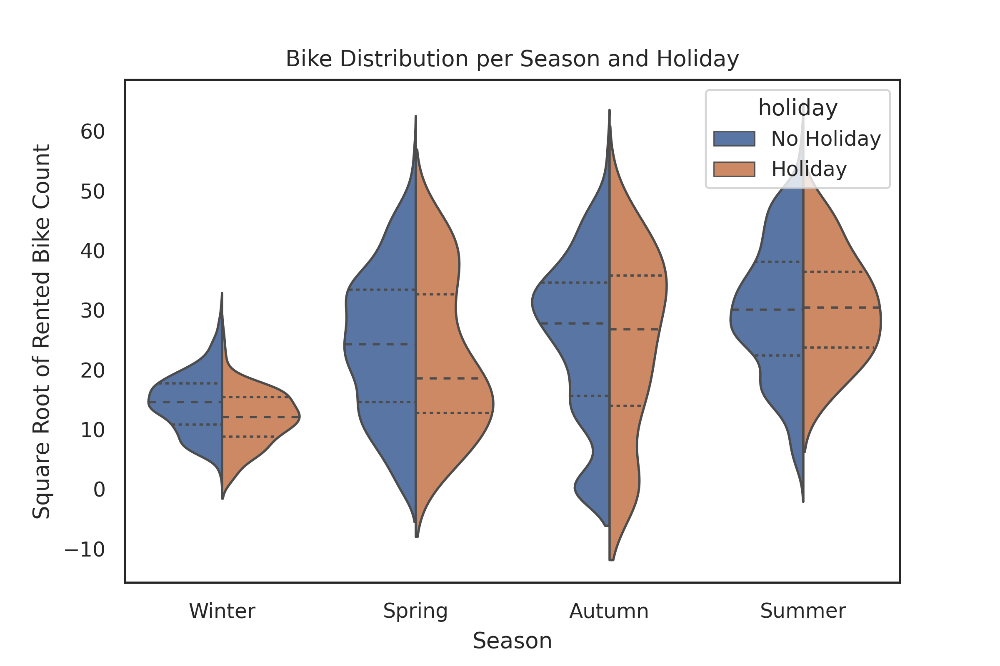

# Top Drivers of Bike Sharing Demand in Seoul

Bike sharing system is a reality in many urban cities in the world and one of the biggest
concern is maintaining a reliable supply of bicycles to meet public demand regardless of time
and weather.

At this analysis I tried to build a highly interpretable model to predict bike demand as well as to understand the main attributes responsible for its fluctuation.
Below you can see my key findings, but if you are interested I also have a full report [here](./report/report.pdf).

## Key takeaways
Demand for bike sharing is mainly driven by time, solar radiation, rainfall, temperature and season. The relationship is not linear and the best model has a polynomial degree equal to 3 and explains more than 80% of the total bikes rented per hour. Solar Radiation has a quadratic relationship with the target value, that is, it has an optimal value and after that, more solar radiation decreases the amount of bikes rented per hour.

# Brief data description
The dataset contains 14 attributes and 8760 observations. Each observation is one hour long and has the total number of bikes rented per hour. The data is one year long,
from december 2017 to november 2018. The attributes are: Date, Time, Weather descriptions (Temperature, Windspeed, Rainfall, Season, etc) and a boolean that indicates whether the day is Holiday or not.

## Average demande per hour
Despite the fact that mean of rented bikes per hour increases along the day, the key point are two peaks in rush hours.

Although this finding was expected, it suggests that the problem is not linear in time and guides the solution to polynomial arrangements.

## Bike demand per Season and Holiday
As expected during winter the demand is lower, but looking at the seasons segregated by holiday it seems that during the winter bikes are more used as means of transportation than as leisure activity.

Although these hypothesis have not been formally tested, this variables will present a high influence in the model prediction.

## Models
The $R^2$ is the percentage of the target value (total of rented bikes per hour) that is explained by the model. the approach to selecting a model was very straightforward. First the Vanilla Linear Regression was used to find the optimum polynomial degree. After we tried to reduce de number of variables and improve the fitness through regularization. 
|Best Estimator|$R^2$|
|-|-|
|Lasso(alpha=0.0060, max iter=10000, random state=0)|0.8153|
|ElasticNet(alpha=0.0060, l1 ratio=1.0, max iter=10000, random state=0)|0.8153|
|OrthogonalMatchingPursuit(n nonzero coefs=155)|0.8144|

Here Lasso and ElasticNet are the same model as the penality is totally $l_1$. The difference between Lasso and OrthogonalMatchingPursuit is small, but Lasso performed better and achieve more regularization and zero coefficients. Finally, during the test set both models performed as well as in the cross-validation.
|Model|$R^2$|
|-|-|
|Lasso|0.8156|
|OrthogonalMatchingPursuit|0.8118|

Find out more in the report!

